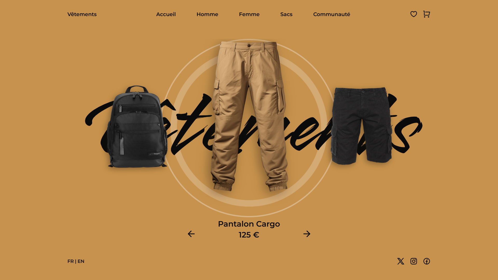

<div align="center">  
  <a href="https://image-slider-clothing.netlify.app/" target="_blank">  
      
  </a>  
  </br></br>  
  <h3 align="center">👕 Image Slider de Vêtements</h3>  
</div>

## <br /> 📌 Sommaire

&nbsp;&nbsp;&nbsp; 🎨 &nbsp; [**Introduction**](#introduction)<br />
&nbsp;&nbsp;&nbsp; 🛠️ &nbsp; [**Technologies**](#technologies)<br />
&nbsp;&nbsp;&nbsp; 🎯 &nbsp; [**Fonctionnalités**](#fonctionnalités)<br />
&nbsp;&nbsp;&nbsp; 🚀 &nbsp; [**Installation**](#installation)<br />

## <br /> <a name="introduction">🎨 Introduction</a>

Ce projet propose un slider interactif de vêtements, pensé pour offrir une navigation fluide et une présentation élégante des produits.

Chaque slide met en avant un article avec son nom, prix et visuel, au sein d’un carrousel animé avec **Swiper.js**, **ScrollReveal**, et **CSS personnalisé**.

Parfait pour projets e-commerce, des landing pages produits ou des galeries de collections mode.

## <br /> <a name="technologies">🛠️ Technologies</a>

- HTML5 sémantique et accessible
- CSS3 moderne (variables, media queries, transitions)
- JavaScript ES6 structuré et clair
- [Swiper.js](https://swiperjs.com/) pour un carrousel performant et personnalisable
- [ScrollReveal](https://scrollrevealjs.org/) pour des animations d’entrée
- Remix Icons pour des icônes vectorielles modernes

## <br /> <a name="fonctionnalités">🎯 Fonctionnalités</a>

- Carrousel horizontal avec navigation par flèches
- Animation d’entrée fluides avec ScrollReveal
- Menu mobile animé avec effet affiché/caché
- Affichage optimisé sur tous les formats
- Structure modulaire pour une intégration facile
- Footer complet avec liens sociaux et sélection de langue

## <br /> <a name="installation">🚀 Installation</a>

### ✅ Prérequis

- [Google Chrome](https://www.google.com/) &nbsp;—&nbsp; Navigateur moderne
- [Visual Studio Code](https://code.visualstudio.com/) &nbsp;—&nbsp; Éditeur de code
- [Live Server](https://marketplace.visualstudio.com/items?itemName=ritwickdey.LiveServer) &nbsp;—&nbsp; Extension VS Code

### 📥 Cloner le projet

```bash
git clone https://github.com/ValentinMadiot/img-slider-clothing_js
cd img-slider-clothing_js
```

### ▶️ Lancer le projet

Il suffit d’ouvrir le fichier `index.html` dans un navigateur, ou d’utiliser l’extension **Live Server** sur VS Code pour un aperçu dynamique.
